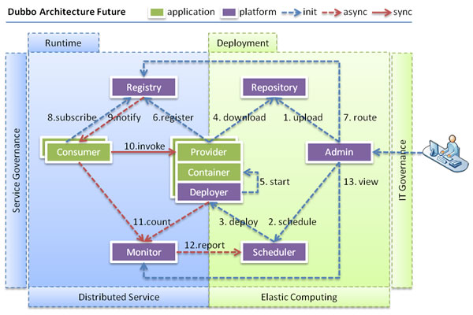

## Dubbox RPC远程服务调用实战

### 一 DubboX介绍

DUBBO是一个分布式服务框架，致力于**提供高性能和透明化的RPC远程服务调用方案**，是阿里巴巴SOA**服务化治理方案**的核心框架，每天为2,000+个服务提供3,000,000,000+次访问量支持，并被广泛应用于阿里巴巴集团的各成员站点。

Dubbo架构图如下:


**节点角色说明：**

* **Provider:**
  暴露服务的服务提供方。
* **Consumer:**
  调用远程服务的服务消费方。
* **Registry:**
  服务注册与发现的注册中心。
* **Monitor:**
  统计服务的调用次调和调用时间的监控中心。
* **Container:**
  服务运行容器。

**调用关系说明：**

* 1. 服务容器负责启动，加载，运行服务提供者。
* 1. 服务提供者在启动时，向注册中心注册自己提供的服务。
* 1. 服务消费者在启动时，向注册中心订阅自己所需的服务。
* 1. 注册中心返回服务提供者地址列表给消费者，如果有变更，注册中心将基于长连接推送变更数据给消费者。
* 1. 服务消费者，从提供者地址列表中，基于软负载均衡算法，选一台提供者进行调用，如果调用失败，再选另一台调用。
* 1. 服务消费者和提供者，在内存中累计调用次数和调用时间，定时每分钟发送一次统计数据到监控中心。

**\(1\) 连通性：**

* 注册中心负责服务地址的注册与查找，相当于目录服务，服务提供者和消费者只在启动时与注册中心交互，注册中心不转发请求，压力较小
* 监控中心负责统计各服务调用次数，调用时间等，统计先在内存汇总后每分钟一次发送到监控中心服务器，并以报表展示
* 服务提供者向注册中心注册其提供的服务，并汇报调用时间到监控中心，此时间不包含网络开销
* 服务消费者向注册中心获取服务提供者地址列表，并根据负载算法直接调用提供者，同时汇报调用时间到监控中心，此时间包含网络开销
* 注册中心，服务提供者，服务消费者三者之间均为长连接，监控中心除外
* 注册中心通过长连接感知服务提供者的存在，服务提供者宕机，注册中心将立即推送事件通知消费者
* 注册中心和监控中心全部宕机，不影响已运行的提供者和消费者，消费者在本地缓存了提供者列表
* 注册中心和监控中心都是可选的，服务消费者可以直连服务提供者

**\(2\) 健状性：**

* 监控中心宕掉不影响使用，只是丢失部分采样数据
* 数据库宕掉后，注册中心仍能通过缓存提供服务列表查询，但不能注册新服务
* 注册中心对等集群，任意一台宕掉后，将自动切换到另一台
* 注册中心全部宕掉后，服务提供者和服务消费者仍能通过本地缓存通讯
* 服务提供者无状态，任意一台宕掉后，不影响使用
* 服务提供者全部宕掉后，服务消费者应用将无法使用，并无限次重连等待服务提供者恢复

**\(3\) 伸缩性：**

* 注册中心为对等集群，可动态增加机器部署实例，所有客户端将自动发现新的注册中心
* 服务提供者无状态，可动态增加机器部署实例，注册中心将推送新的服务提供者信息给消费者

**\(4\) 升级性：**

* 当服务集群规模进一步扩大，带动IT治理结构进一步升级，需要实现动态部署，进行流动计算，现有分布式服务架构不会带来阻力：



Dubbox是当当网根据自身的需求，为Dubbo实现了一些新功能，并将其命名为Dubbox,主要新功能包括主要的新功能包括：

* **支持REST风格远程调用（HTTP + JSON/XML\)**
  ：基于非常成熟的JBoss RestEasy框架，在dubbo中实现了REST风格（HTTP + JSON/XML）的远程调用，以显著简化企业内部的跨语言交互，同时显著简化企业对外的Open API、无线API甚至AJAX服务端等等的开发。事实上，这个REST调用也使得Dubbo可以对当今特别流行的“微服务”架构提供基础性支持。 另外，REST调用也达到了比较高的性能，在基准测试下，HTTP + JSON与Dubbo 2.x默认的RPC协议（即TCP + Hessian2二进制序列化）之间只有1.5倍左右的差距，详见下文的基准测试报告。


* **支持基于Kryo和FST的Java高效序列化实现**
  ：基于当今比较知名的
  [Kryo](https://github.com/EsotericSoftware/kryo)
  和
  [FST](https://github.com/RuedigerMoeller/fast-serialization)
  高性能序列化库，为Dubbo 默认的RPC协议添加新的序列化实现，并优化调整了其序列化体系，比较显著的提高了Dubbo RPC的性能，详见下图和文档中的基准测试报告。


* **支持基于嵌入式Tomcat的HTTP remoting体系**：基于嵌入式tomcat实现dubbo的HTTP remoting体系（即dubbo-remoting-http），用以逐步取代Dubbo中旧版本的嵌入式Jetty，可以显著的提高REST等的远程调用性能，并将Servlet API的支持从2.5升级到3.1。（注：除了REST，dubbo中的WebServices、Hessian、HTTP Invoker等协议都基于这个HTTP remoting体系）。

* **升级Spring**：将dubbo中Spring由2.x升级到目前最常用的3.x版本，减少项目中版本冲突带来的麻烦。

* **升级ZooKeeper客户端**：将dubbo中的zookeeper客户端升级到最新的版本，以修正老版本中包含的bug。

上面很多功能已在当当网内部稳定的使用，现在开源出来，供大家参考和指正。也希望感兴趣的朋友也来为Dubbo贡献更多的改进。

注：dubbox和dubbo 2.x是兼容的，没有改变dubbo的任何已有的功能和配置方式（除了升级了Spring之类的版本）。另外，dubbox也严格遵循了Apache 2.0许可证的要求。

### 二  Dubbox注册中心和服务化治理

#### 2.1 Zookeeper的安装和使用

将Zookeeper的安装包\(zookeeper-3.4.6.tar.gz\)上传至服务器,解压缩,修改环境变量,即可通过zkServer.sh启动zookeeper服务。

```
[root@tony local]# tar -zxvf zookeeper-3.4.6.tar.gz ##解压缩
[root@tony local]# mv zookeeper-3.4.6 zookeeper ##重命名
[root@tony local]# mv /usr/local/zookeeper/conf/zoo_sample.cfg  /usr/local/zookeeper/conf/zoo.cfg #重命名配置文件
[root@tony local]# vim /etc/profile ##修改系统环境变量配置文件
export ZOOKEEPER_HOME=/usr/local/zookeeper ##增加zookeeper主目录至系统环境变量
export PATH=$PATH:$ZOOKEEPER_HOME/bin 

[root@tony local]# source /etc/profile #立即生效
[root@tony bin]# sh /usr/local/zookeeper/bin/zkServer.sh start ##启动zookeeper服务
[root@tony bin]# ps -ef|grep zookeeper ##查看zookeeper进程
```

### 2.2 Dubbox服务化治理的使用

dubbox的服务治理是通过其提供的一个web程序\(dubbo-admin.war\)实现的，通常需要修改war包中的dubbo.properties文件中的注册中心地址。

```
dubbo.registry.address=zookeeper://192.168.1.14:2181
 #修改注册中心zookeeper的地址
dubbo.admin.root.password=root
dubbo.admin.guest.password=guest
```

然后将dubbo.war包部署到web服务器上即可通过[http://sit.guoyunzaixian.com/dubbo/](http://sit.guoyunzaixian.com/dubbo/) 来访问dubbox提供的服务治理

默认用户是root,密码也是root。

主页如下:

### 三 基于Dubbo协议的RPC远程服务调用案例

#### 3.1 基于Dubbo协议的RPC远程服务提供者

##### RPC远程服务调用服务接口声明:

```
package com.guoyun.dubbox.api;

/**
 * 定义一个接口
 * 接口中包含一个sayHi()方法,该方法由服务提供者去实现,被服务调用者调用
 * Created by tony on 2017/3/20.
 */
public interface SampleService {

     String sayHi(String name);
}
```

##### RPC远程服务提供者实现接口:

```
package com.guoyun.dubbox.provider.dubbo;

import com.guoyun.dubbox.api.SampleService;
import org.springframework.stereotype.Service;

/**
 * SampleServiceImpl
 *
 * @author Liuguanglei liugl@ekeyfund.com
 * @create 2017-03-下午2:34
 */
@Service("sampleService")
public class SampleServiceImpl implements SampleService {
    @Override
    public String sayHi(String name) {
        return "Hi "+name;
    }
}
```

##### RPC远程服务暴露接口配置:

```
<?xml version="1.0" encoding="UTF-8"?>
<beans xmlns="http://www.springframework.org/schema/beans"
       xmlns:xsi="http://www.w3.org/2001/XMLSchema-instance"
       xmlns:context="http://www.springframework.org/schema/context"
       xmlns:dubbo="http://code.alibabatech.com/schema/dubbo"
       xsi:schemaLocation="http://www.springframework.org/schema/beans http://www.springframework.org/schema/beans/spring-beans.xsd
        http://www.springframework.org/schema/context http://www.springframework.org/schema/context/spring-context.xsd
        http://code.alibabatech.com/schema/dubbo http://code.alibabatech.com/schema/dubbo/dubbo.xsd">
    <context:component-scan base-package="com.guoyun.dubbox.provider"/>
    <!-- 提供方应用信息,用于计算依赖关系 -->
    <dubbo:application name="sample-service-provider" owner="guoyun" organization="guoyun"/>

    <!-- 使用zookeeper注册中心暴露服务地址 多个地址 zookeeper://192.168.1.14:2181?backup=192.168.1.15:2181,192.168.1.16:2181-->
    <dubbo:registry address="zookeeper://192.168.1.14:2181"/>

    <!-- 用dubbo协议在20880端口暴露服务 -->
    <dubbo:protocol name="dubbo" port="20880"/>

    <dubbo:service interface="com.guoyun.dubbox.api.SampleService" ref="sampleService"/>

</beans>
```

##### RPC远程服务启动类:

```
package com.guoyun.dubbox.provider.start;

import org.apache.logging.log4j.LogManager;
import org.apache.logging.log4j.Logger;
import org.springframework.context.support.ClassPathXmlApplicationContext;

import java.io.IOException;

/**
 * Sample Service Provider Start Application
 *
 * @author Liuguanglei liugl@ekeyfund.com
 * @create 2017-03-下午2:45
 */
public class SampleServiceProviderStart {


    private static final Logger logger = LogManager.getLogger();

    public static void main(String[]args) throws IOException {

        ClassPathXmlApplicationContext context=new ClassPathXmlApplicationContext("sample-service-provider.xml");

        context.start();

        logger.info("Sample Service Provider Start......");

        System.in.read(); //阻塞


    }
}
```

##### 发布服务后的服务治理界面

#### 3.2 基于Dubbo协议的RPC远程服务调用者

RPC远程服务调用实现

只需要启动容器，像访问本地的服务一样调用远程服务

```
package com.guoyun.dubbox.consumer;

import com.guoyun.dubbox.api.SampleService;
import org.apache.logging.log4j.LogManager;
import org.apache.logging.log4j.Logger;
import org.springframework.context.support.ClassPathXmlApplicationContext;

/**
 * Sample Service Provider Start
 *
 * @author Liuguanglei liugl@ekeyfund.com
 * @create 2017-03-下午2:57
 */
public class SampleServiceConsumerStart {

    private static final Logger logger = LogManager.getLogger();

    public static void main(String[]args){


        ClassPathXmlApplicationContext context=new ClassPathXmlApplicationContext("sample-service-consumer.xml");
        context.start();

        SampleService sampleService= (SampleService) context.getBean("consumerSampleService");
        String invokeResult =sampleService.sayHi("Tony");

        logger.info("rpc invoke result : "+invokeResult);

    }
}
```

##### RPC远程服务调用配置

```
<?xml version="1.0" encoding="UTF-8"?>
<beans xmlns="http://www.springframework.org/schema/beans"
       xmlns:xsi="http://www.w3.org/2001/XMLSchema-instance"
       xmlns:context="http://www.springframework.org/schema/context"
       xmlns:dubbo="http://code.alibabatech.com/schema/dubbo"
       xsi:schemaLocation="http://www.springframework.org/schema/beans http://www.springframework.org/schema/beans/spring-beans.xsd
        http://www.springframework.org/schema/context http://www.springframework.org/schema/context/spring-context.xsd
        http://code.alibabatech.com/schema/dubbo http://code.alibabatech.com/schema/dubbo/dubbo.xsd">
    <context:component-scan base-package="com.guoyun.dubbox.consumer"/>
    <!-- 提供方应用信息,用于计算依赖关系 -->
    <dubbo:application name="sample-service-consumer" owner="guoyun" organization="guoyun"/>

    <!-- 使用zookeeper注册中心暴露服务地址 多个地址 zookeeper://192.168.1.14:2181?backup=192.168.1.15:2181,192.168.1.16:2181-->
    <dubbo:registry address="zookeeper://192.168.1.14:2181"/>

    <dubbo:annotation  package="com.guoyun.dubbox"/>
    <!-- 用dubbo协议在20880端口暴露服务 -->
    <dubbo:protocol name="dubbo" port="20880"/>

    <!-- 生成远程服务代理，可以和本地Bean一样使用sampleService-->
    <dubbo:reference interface="com.guoyun.dubbox.api.SampleService" id="consumerSampleService"/>

</beans>
```

### 四 基于注解的方式实现RPC远程服务发布与调用

#### 4.1 基于注解方式实现RPC远程服务发布

RPC远程服务调用接口声明

```
import com.guoyun.common.bean.User;

/**
 * 用户接口
 * Created by tony on 2017/3/20.
 */
public interface UserService {


    /**
     * 根据ID获取用户
     * @param id
     * @return
     */
    User getUser(Long id);


    /**
     * 用户注册
     * @param user
     * @return
     */
    Long registerUser(User user);
}
```

RPC远程服务调用接口实现

```
package com.guoyun.dubbox.provider.dubbo;

import com.alibaba.dubbo.config.annotation.Service;
import com.guoyun.common.bean.User;
import com.guoyun.dubbox.api.UserService;

import java.util.concurrent.atomic.AtomicLong;

/**
 * User Service Impl
 *
 * @author Liuguanglei liugl@ekeyfund.com
 * @create 2017-03-下午4:43
 */
@Service(interfaceClass = com.guoyun.dubbox.api.UserService.class,protocol = "dubbo",owner = "tony",version = "1.0.0")
public class UserServiceImpl implements UserService {

    private final AtomicLong idGen=new AtomicLong();


    @Override
    public User getUser(Long id) {
        return new User(id,"username"+id,"123456");
    }

    @Override
    public Long registerUser(User user) {
        return idGen.incrementAndGet();
    }
}
```

RPC远程服务调用接口实现配置

```
<?xml version="1.0" encoding="UTF-8"?>
<beans xmlns="http://www.springframework.org/schema/beans"
       xmlns:xsi="http://www.w3.org/2001/XMLSchema-instance"
       xmlns:context="http://www.springframework.org/schema/context"
       xmlns:dubbo="http://code.alibabatech.com/schema/dubbo"
       xsi:schemaLocation="http://www.springframework.org/schema/beans http://www.springframework.org/schema/beans/spring-beans.xsd
        http://www.springframework.org/schema/context http://www.springframework.org/schema/context/spring-context.xsd
        http://code.alibabatech.com/schema/dubbo http://code.alibabatech.com/schema/dubbo/dubbo.xsd">
    <context:component-scan base-package="com.guoyun.dubbox.provider.dubbo"/>
    <!-- 提供方应用信息,用于计算依赖关系 -->
    <dubbo:application name="user-service-provider" owner="guoyun" organization="guoyun"/>

    <!-- 使用zookeeper注册中心暴露服务地址 多个地址 zookeeper://192.168.1.14:2181?backup=192.168.1.15:2181,192.168.1.16:2181-->
    <dubbo:registry address="zookeeper://192.168.1.14:2181"/>

    <dubbo:annotation package="com.guoyun.dubbox.provider.dubbo"/>

    <!-- 用dubbo协议在20880端口暴露服务 -->
    <dubbo:protocol name="dubbo" port="20880"/>


</beans>
```

RPC远程服务调用接口实现启动类

```
import org.apache.logging.log4j.LogManager;
import org.apache.logging.log4j.Logger;
import org.springframework.context.support.ClassPathXmlApplicationContext;

import java.io.IOException;

/**
 * User Service Provider Start
 *
 * @author Liuguanglei liugl@ekeyfund.com
 * @create 2017-03-下午4:50
 */
public class UserServiceProviderStart {

    private static final Logger logger = LogManager.getLogger();

    public static void main(String[]args) throws IOException {

        ClassPathXmlApplicationContext context=new ClassPathXmlApplicationContext("user-service-provider.xml");

        context.start();

        logger.info("User Service Provider Start......");

        System.in.read(); //阻塞


    }

}
```

4.2 RPC远程服务调用

RPC远程服务调用者启动类

```
package com.guoyun.dubbox.consumer;

import com.guoyun.common.bean.User;
import com.guoyun.dubbox.api.UserService;
import org.apache.logging.log4j.LogManager;
import org.apache.logging.log4j.Logger;
import org.springframework.context.support.ClassPathXmlApplicationContext;

/**
 * User Service Provider Start
 *
 * @author Liuguanglei liugl@ekeyfund.com
 * @create 2017-03-下午2:57
 */
public class UserServiceConsumerStart {

    private static final Logger logger = LogManager.getLogger();

    public static void main(String[]args){


        ClassPathXmlApplicationContext context=new ClassPathXmlApplicationContext("user-service-consumer.xml");
        context.start();

        UserService userService= context.getBean(UserService.class);
        User user = userService.getUser(22L);
        logger.info("invoke result "+user);

    }
}
```

RPC远程服务调用配置

```
<?xml version="1.0" encoding="UTF-8"?>
<beans xmlns="http://www.springframework.org/schema/beans"
       xmlns:xsi="http://www.w3.org/2001/XMLSchema-instance"
       xmlns:context="http://www.springframework.org/schema/context"
       xmlns:dubbo="http://code.alibabatech.com/schema/dubbo"
       xsi:schemaLocation="http://www.springframework.org/schema/beans http://www.springframework.org/schema/beans/spring-beans.xsd
        http://www.springframework.org/schema/context http://www.springframework.org/schema/context/spring-context.xsd
        http://code.alibabatech.com/schema/dubbo http://code.alibabatech.com/schema/dubbo/dubbo.xsd">
    <!-- 提供方应用信息,用于计算依赖关系 -->
    <dubbo:application name="user-service-consumer" owner="guoyun" organization="guoyun"/>

    <!-- 使用zookeeper注册中心暴露服务地址 多个地址 zookeeper://192.168.1.14:2181?backup=192.168.1.15:2181,192.168.1.16:2181-->
    <dubbo:registry address="zookeeper://192.168.1.14:2181"/>

    <!-- 用dubbo协议在20880端口暴露服务 -->
    <dubbo:protocol name="dubbo" port="20880"/>

    <dubbo:reference interface="com.guoyun.dubbox.api.UserService" id="consumerUserService" version="1.0.0"/>


</beans>
```

### 五 服务之间的依赖调用

在实际开发场景中可能会存在一种情况，DependencyServiceProvider可能会被DependencyServiceConsumer服务调用，而DependencyServiceProvider本身又会去调用SampleServiceProvider服务来实现自身的业务逻辑处理。

依赖服务接口声明

```
package com.guoyun.dubbox.api;

/**
 * 服务之间的依赖调用
 *
 * @author Liuguanglei liugl@ekeyfund.com
 * @create 2017-03-下午6:38
 */
public interface DependencyService {


    public String dependency();
}
```

依赖服务接口实现

```
package com.guoyun.dubbox.provider.dubbo;

import com.guoyun.dubbox.api.DependencyService;
import com.guoyun.dubbox.api.SampleService;
import org.apache.logging.log4j.LogManager;
import org.apache.logging.log4j.Logger;
import org.springframework.beans.factory.annotation.Autowired;
import org.springframework.stereotype.Service;

/**
 * Dependency Service Impl
 *
 * @author Liuguanglei liugl@ekeyfund.com
 * @create 2017-03-下午6:38
 */
@Service("dependencyService")
@com.alibaba.dubbo.config.annotation.Service(interfaceClass = com.guoyun.dubbox.api.DependencyService.class,protocol = "dubbo",version = "1.0.0",owner = "tony",retries = 2)
public class DependencyServiceImpl implements DependencyService {

    private static final Logger logger = LogManager.getLogger();

    @Autowired
    private SampleService sampleService;

    @Override
    public String dependency() {

        String dependencyMethod=sampleService.sayHi("Tony");
        logger.info( "dependency method invoke result :"+dependencyMethod);

        return "execute invoke dependency method";
    }
}
```

依赖服务启动类

```
 package com.guoyun.dubbox.provider.start;

import org.apache.logging.log4j.LogManager;
import org.apache.logging.log4j.Logger;
import org.springframework.context.support.ClassPathXmlApplicationContext;

import java.io.IOException;

/**
 * Dependency Service Provider Start
 *
 * @author Liuguanglei liugl@ekeyfund.com
 * @create 2017-03-上午10:00
 */
public class DependencyServiceProviderStart {


    private static final Logger logger = LogManager.getLogger();

    public static void main(String[]args) throws IOException {

        ClassPathXmlApplicationContext context=new ClassPathXmlApplicationContext("dependency-service-provider.xml");

        context.start();

        logger.info("Dependency Service Provider Start......");

        System.in.read(); //阻塞


    }
}
```

依赖服务 配置

```
<?xml version="1.0" encoding="UTF-8"?>
<beans xmlns="http://www.springframework.org/schema/beans"
       xmlns:xsi="http://www.w3.org/2001/XMLSchema-instance"
       xmlns:context="http://www.springframework.org/schema/context"
       xmlns:dubbo="http://code.alibabatech.com/schema/dubbo"
       xsi:schemaLocation="http://www.springframework.org/schema/beans http://www.springframework.org/schema/beans/spring-beans.xsd
        http://www.springframework.org/schema/context http://www.springframework.org/schema/context/spring-context.xsd
        http://code.alibabatech.com/schema/dubbo http://code.alibabatech.com/schema/dubbo/dubbo.xsd">
    <context:component-scan base-package="com.guoyun.dubbox.provider.dubbo"/>
    <!-- 提供方应用信息,用于计算依赖关系 -->
    <dubbo:application name="dependency-service-provider" owner="guoyun" organization="guoyun"/>

    <!-- 使用zookeeper注册中心暴露服务地址 多个地址 zookeeper://192.168.1.14:2181?backup=192.168.1.15:2181,192.168.1.16:2181-->
    <dubbo:registry address="zookeeper://192.168.1.14:2181"/>

    <dubbo:annotation package="com.guoyun.dubbox.provider.dubbo"/>

    <!-- 用dubbo协议在20888端口暴露服务 -->
    <dubbo:protocol name="dubbo" port="20888"/>

    <!-- 依赖sampleService-->
    <dubbo:reference interface="com.guoyun.dubbox.api.SampleService" id="dependencySampleService"/>


</beans>
```

调用依赖服务启动类

```
package com.guoyun.dubbox.consumer;

import com.guoyun.dubbox.api.DependencyService;
import org.apache.logging.log4j.LogManager;
import org.apache.logging.log4j.Logger;
import org.springframework.context.support.ClassPathXmlApplicationContext;

/**
 * User Service Provider Start
 *
 * @author Liuguanglei liugl@ekeyfund.com
 * @create 2017-03-下午2:57
 */
public class DependencyServiceConsumerStart {

    private static final Logger logger = LogManager.getLogger();

    public static void main(String[]args){


        ClassPathXmlApplicationContext context=new ClassPathXmlApplicationContext("dependency-service-consumer.xml");
        context.start();

        DependencyService dependencyService= context.getBean(DependencyService.class);
        String invokeResult =dependencyService.dependency();
        logger.info("invoke result "+invokeResult);

    }
}
```

调用依赖服务配置

```
<?xml version="1.0" encoding="UTF-8"?>
<beans xmlns="http://www.springframework.org/schema/beans"
       xmlns:xsi="http://www.w3.org/2001/XMLSchema-instance"
       xmlns:context="http://www.springframework.org/schema/context"
       xmlns:dubbo="http://code.alibabatech.com/schema/dubbo"
       xsi:schemaLocation="http://www.springframework.org/schema/beans http://www.springframework.org/schema/beans/spring-beans.xsd
        http://www.springframework.org/schema/context http://www.springframework.org/schema/context/spring-context.xsd
        http://code.alibabatech.com/schema/dubbo http://code.alibabatech.com/schema/dubbo/dubbo.xsd">
    <!-- 提供方应用信息,用于计算依赖关系 -->
    <dubbo:application name="user-service-consumer" owner="guoyun" organization="guoyun"/>

    <!-- 使用zookeeper注册中心暴露服务地址 多个地址 zookeeper://192.168.1.14:2181?backup=192.168.1.15:2181,192.168.1.16:2181-->
    <dubbo:registry address="zookeeper://192.168.1.14:2181"/>

    <!-- 用dubbo协议在20880端口暴露服务 -->
    <dubbo:protocol name="dubbo" port="20880" />

    <dubbo:reference interface="com.guoyun.dubbox.api.DependencyService" id="consumerDependcyService" version="1.0.0" />


</beans>
```


### 六  基于kryo的序列化使用       

注册被序列化的类          

```

import com.alibaba.dubbo.common.serialize.support.SerializationOptimizer;
import com.guoyun.dubbox.common.bean.User;

import java.util.Collection;
import java.util.LinkedList;
import java.util.List;

/**
 * SerializationOptimizerImpl
 *
 * @author Liuguanglei liugl@ekeyfund.com
 * @create 2017-03-上午11:57
 */
public class SerializationOptimizerImpl implements SerializationOptimizer {
    @Override
    public Collection<Class> getSerializableClasses() {

        List<Class> clazz =new LinkedList<>();
        clazz.add(User.class);
        return clazz;
    }
}

```

配置使用Kryo实现对象的序列化

```
    <dubbo:protocol name="dubbo" port="20880" serialization="kryo" optimizer="com.guoyun.dubbox.common.util.SerializationOptimizerImpl"/>

```


